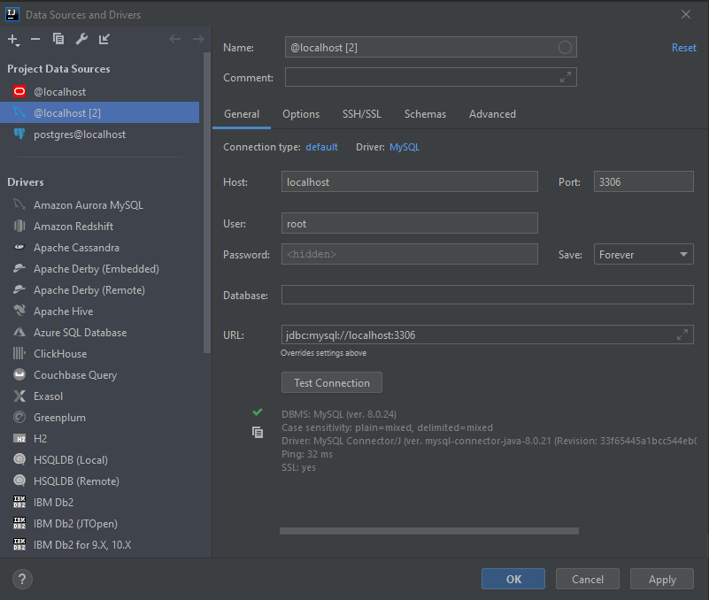

## Run the database
To run the database, run the following command from the mysql folder
```bash
docker-compose up
```
Volume binding is set up so that the data is not lost after the container is stopped.
Consider changing the host folder to what suits you better.

## Import sample data
If you want generate the schema and data used as examples in the book
[Database System Concepts](https://www.db-book.com/db7/university-lab-dir/db-tips.html),
run **import-db-book-data.sh**

## Intellij setup
**User**: root

**Password**: mysql

