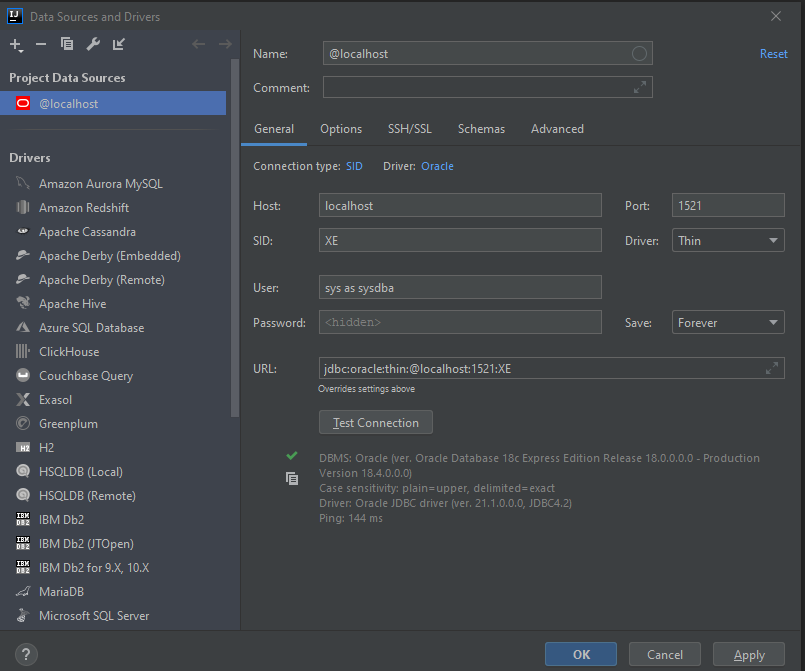

# Oracle 18c XE
This folder contains a docker-compose setup for the Oracle 18 XE database.
Since  Oracle is not hosting the image on docker hub, you will need to first build the image locally.

## Build the image
The oracle express image needs to be built locally. To do so, clone the following repo: https://github.com/oracle/docker-images
Go to OracleDatabase/SingleInstance/docker-files and run the following command
```bash
buildContainerImage.sh -v 18.4.0 -x
```
This will create an image for oracle 18.4.0 express edition

## Run the database
Once you have built the docker image, you should be able to spin up the container with
```
docker-compose up
```
Volume binding is set up so that the data is not lost after the container is stopped.
Consider changing the host folder to what suits you better.

## Import sample data
If you want generate the schema and data used as examples in the book
[Database System Concepts](https://www.db-book.com/db7/university-lab-dir/db-tips.html),
run **import-db-book-data.sh**

## Intellij setup
**User**: sys as sysdba

**Password**: oracle

